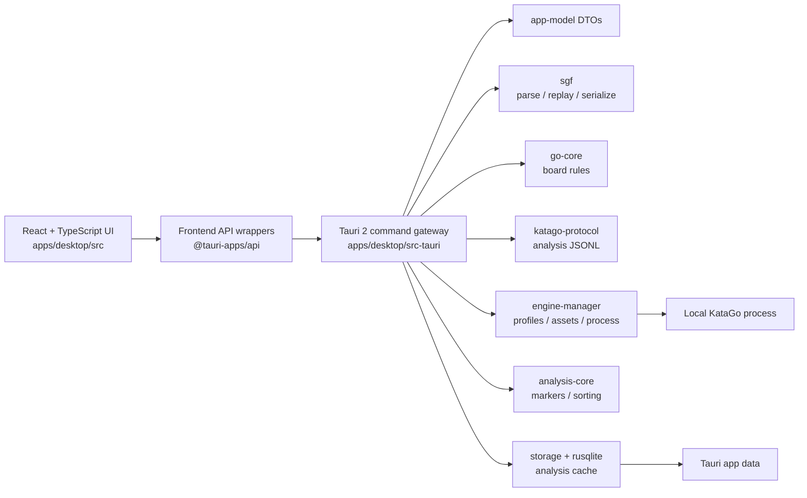

# LizzieYzy Next Architecture

LizzieYzy Next is the Tauri 2 + Rust + TypeScript desktop architecture being built beside the Java/Swing maintenance line. The goal is to move user-visible behavior into smaller testable domains without claiming full legacy parity before the evidence exists.

## Current System Shape

The UI consumes DTOs and view models. It does not consume raw KataGo JSON and does not own long-running engine processes. Rust owns file I/O, SGF parsing, process execution, cancellation, app-data persistence, and SQLite.

## Modules

### `apps/desktop`

React + TypeScript desktop UI built with Vite. The current UI includes board rendering, SGF text/import workflow, native open/save entry points, winrate and analysis panels, cache status, and engine profile controls.

The browser preview can exercise UI fallback paths and fake analysis, but it cannot perform native file dialogs, app-data profile persistence, local asset checks, or real KataGo execution.

### `apps/desktop/src-tauri`

Tauri 2 command gateway. It exposes health, SGF parse/replay, native SGF read/write, fake analysis, KataGo one-shot analysis, full-game batch analysis, progress/cancel events, engine profile persistence, asset checks, and analysis cache commands.

This layer should stay a gateway. Domain behavior belongs in crates unless it is directly about Tauri lifecycle, app data paths, command shape, or event emission.

### `crates/app-model`

Shared DTOs for games, moves, positions, candidate moves, analysis frames, engine profiles, assets, health, and problem markers.

### `crates/go-core`

Pure Go board and rules logic. It has no UI, Tauri, storage, or process dependency.

### `crates/sgf`

SGF parsing, replay, and serialization. It preserves the parsed tree for compatibility paths while exposing normalized game and position DTOs to the rest of the app.

### `crates/katago-protocol`

KataGo analysis JSONL query/response modeling and normalization. Raw engine JSON should remain here or in engine-manager helpers; the UI should receive `AnalysisFrameDto`.

### `crates/analysis-core`

Analysis-derived helpers such as candidate sorting and problem marker classification.

### `crates/engine-manager`

Engine profile validation, command construction, asset checks, supervised KataGo execution, batch progress, timeouts, and cancellation.

### `crates/storage`

SQLite schema and storage helpers. The current user-visible cache commands live at the Tauri gateway and use SQLite in app data; long-term storage logic should continue moving behind this crate boundary as schemas stabilize.

## Data Flow

1. The user opens or edits SGF in the React UI.
2. The frontend calls Tauri commands through API wrapper functions.
3. Rust parses SGF into DTOs and replays positions through `sgf` and `go-core`.
4. The user configures engine profiles and runs asset checks through `engine-manager`.
5. KataGo analysis requests are generated through `katago-protocol`.
6. `engine-manager` launches KataGo, reads analysis JSONL, emits progress, and supports cancellation.
7. Responses are normalized into `AnalysisFrameDto` and classified by `analysis-core`.
8. Analysis results can be persisted and reused through the SQLite cache.
9. The UI renders board state, winrate, candidates, PVs, ownership, policy, problem markers, and cache status from DTOs.

## Persistence

Current app-data persistence includes:

- `lizzieyzy-next-engine-profile.json` for multiple engine profile settings.
- `analysis-cache.sqlite3` for cached analysis records.

The cache key is derived from parsed SGF content and the raw SGF hash. Cache records can be filtered by profile and engine kind. This is an MVP cache contract, not a complete replacement for all legacy storage.

## Production Invariants

- The Rust workspace declares every crate and the Tauri desktop crate explicitly.
- `apps/desktop/src-tauri/tauri.conf.json` uses Tauri 2 config, `org.lizzieyzy.next`, local `127.0.0.1` development URL, and `../dist` frontend output.
- The frontend package exposes `dev`, `build`, `tauri:dev`, and `tauri:build`.
- TypeScript depends on React and `@tauri-apps/api`; build tooling includes Vite, TypeScript, and `@tauri-apps/cli`.
- Rust crates inherit workspace edition/rust-version metadata.
- Golden SGF fixtures live under `tests/golden`.
- CI and local acceptance run scaffold validation before deeper Node and Rust checks.
- Release acceptance runs `scripts/validate_release_assets.py` to verify Tauri metadata, bundle identifiers, dry-run artifact expectations, and the safe release workflow.

## Boundaries

- UI code should call wrapper functions in `apps/desktop/src/api` instead of scattering raw `invoke` calls.
- Tauri commands should return structured DTOs or explicit string errors.
- SGF, Go rules, KataGo protocol, analysis classification, engine execution, and storage should remain separate domains.
- Provider integrations such as Fox, Yike, and readboard should be modeled as providers or sidecars behind Rust/TypeScript boundaries, not as UI-specific shortcuts.
- Provider/readboard code should have offline contract or domain tests before being wired into release claims. Live Fox/Yike network behavior and live readboard sidecar behavior require separate environment validation.
- Java/Swing files are behavior references during this migration track and should not be edited for Next scaffold validation.

## Release Readiness Meaning

Passing scaffold validation and CI means the Next architecture is structurally healthy. Passing release preflight means the Tauri config and release dry-run workflow still match the expected safe metadata contract. Neither result means the Tauri app has shipped, reached full Java/Swing parity, completed live Fox/Yike/readboard migration, or produced signed production installers.
